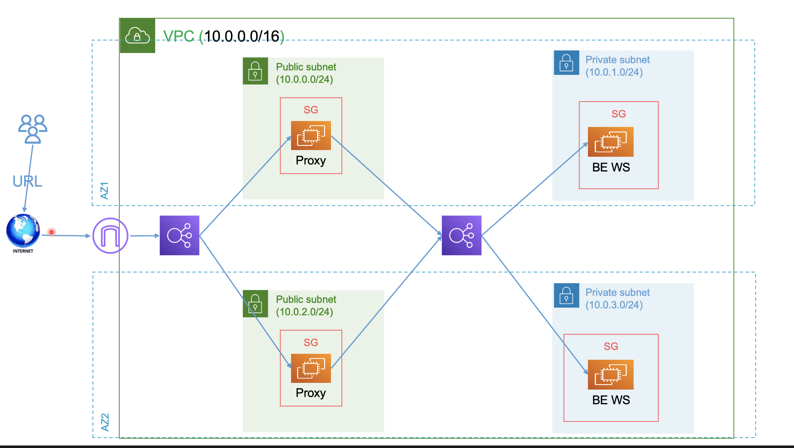

# lap1


## backend-web-app
> run on privet vm 
```bash
#!/bin/bash
sudo yum update -y
sudo yum install httpd -y
sudo systemctl enable --now httpd
echo " hello world from  ip : " > /var/www/html/index.html
hostname -I  >> /var/www/html/index.html
```
## proxy

> run on public vm
```bash
#!/bin/bash
sudo yum update -y
sudo yum install httpd -y
sudo systemctl enable --now httpd

conf="
<VirtualHost *:*>
        ProxyPreserveHost on
        ServerAdmin ec2-user@localhost
        ProxyPass / http://internal-privet-iti-lb-1957479526.us-east-1.elb.amazonaws.com/
        ProxyPassReverse / http://internal-privet-iti-lb-1957479526.us-east-1.elb.amazonaws.com/
</VirtualHost>
"
echo "$conf" >> /etc/httpd/conf/httpd.conf

sudo systemctl restart httpd

```

## configure httpd as proxy


####  ssh on public vm and run the following command
```bash
vim /etc/httpd/conf/httpd.conf
```

```bash

<VirtualHost *:*>
        ProxyPreserveHost on
        ServerAdmin ec2-user@localhost
        ProxyPass / http://internal-privet-iti-lb-1957479526.us-east-1.elb.amazonaws.com/
        ProxyPassReverse / http://internal-privet-iti-lb-1957479526.us-east-1.elb.amazonaws.com/
</VirtualHost>

```
> After edit the file, restart the httpd service

```bash
sudo systemctl restart httpd
```
## Test app
http://public-iti-lb-1805198897.us-east-1.elb.amazonaws.com/


