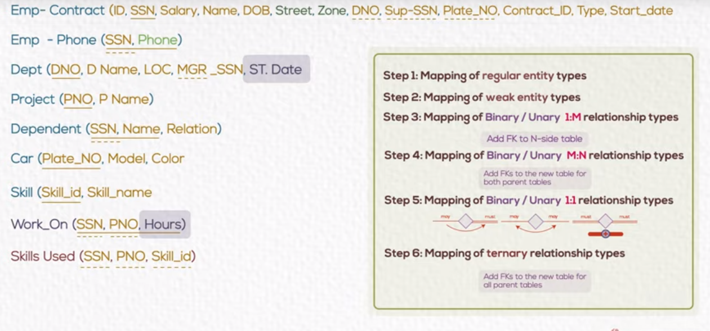

# Mapping 
Convert conceptual design to logical design 

## Relational database
stores data in a form of tables

## step 1:
Mapping of regular entity
Create table for each entity

- single attribute `id`,`ssn` ,`name`
- composite attribute `address`=> `street`,`zone`

>Emp(id,<u>**SSN**</u>,name,DOB ,street ,zone)

- chose the primary key
 
- multiple attributes `phone`
create table for it
- ssn as foreign key

> Emp -phone(<u><u>SSN</u>,phone</u>)

- new primary key -> composite key phone and ssn

mapping weak entity
- Add foreign key of owner entity => created a new composite key

## Mapping of Relationship
- 1 to M
take primary key of `one`side and add it as foreign key of `many` side

e.g Employee > department DNO 

> Emp(id,<u>**SSN**</u>,name,DOB ,street ,zone ,<u>DNO</u>)

- M to N

Add foreign key to a new table

Attribute on relationship follow fore

Work_on(<u>**SSN**</u>,<u>PNO</u>,hours)

- one to one

According to participation
- may may

take primary key of any side and put it on other

- must must

merge two tables

- may must

take primary key of may side and add it as foreign key of must side

## mapping ternary relationship

create new table and take primary key of three entities
as foreign keys

## ERD summary

- Step 1: Mapping of regular entity types
- Step 2: Mapping of weak entity types
- Step 3: Mapping of Binary / Unary 1:M relationship types
- Step 4: Mapping of Binary / Unary M:N relationship types
- Step 5: Mapping of Binary / Unary 1:1 relationship types
- Step 6: Mapping of ternary relationship types

