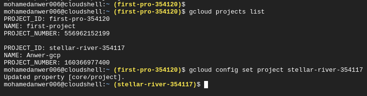

### **1.Explore Google Cloud Console.**
> done
### **2.Setup a billing method on your google account.**
> hosted by Bassem
### **3.Create a GCP project.**

### **4. Assign your billing account to your project.**
> hosted by Bassem
### **5.Setup project budget.**
> hosted by Bassem
### **6.Setup billing alerts.**
> hosted by Bassem
### **7.Using cloud shell, list all projects and set default project.**

### **8.Install and configure gcloud SDK on your pc.**
> done 

### **9.List all projects using gcloud SDK and set default project**
> done
