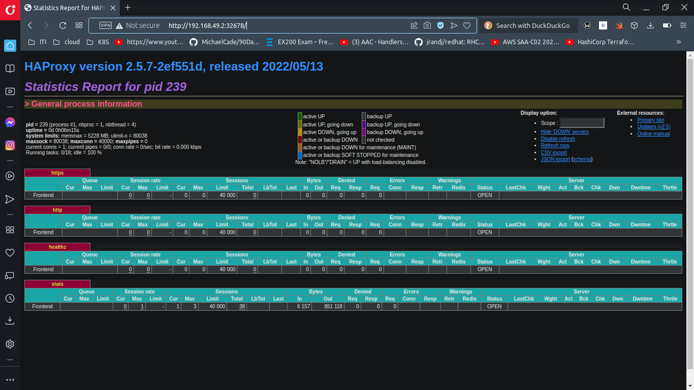

#### ----------------- 1 ---------------------

```
mohamed@DevOps:$ kubectl create ns haproxy-controller-devops
namespace/haproxy-controller-devops created
```

#### ----------------- 2 ---------------------

```yaml
apiVersion: v1
kind: ServiceAccount
metadata:
  creationTimestamp: null
  name: haproxy-service-account-devops
  namespace: haproxy-controller-devops
```
#### ----------------- 3 ---------------------

```yaml
apiVersion: rbac.authorization.k8s.io/v1
kind: ClusterRole
metadata:
  name: haproxy-cluster-role-devops
rules:
    - apiGroups: [""] 
      resources: ["configmaps","secrets","endpoints","nodes","pods","services","namespaces","events","serviceaccounts"]
      verbs: ["get", "list", "watch", "create", "patch", "update"]
```

#### ----------------- 4 ---------------------

```yaml
apiVersion: rbac.authorization.k8s.io/v1
kind: ClusterRoleBinding
metadata:
  name: haproxy-cluster-role-binding-devops
subjects:
    - kind: ServiceAccount
      name: haproxy-service-account-devops
      namespace: haproxy-controller-devops
    
roleRef:
    kind: ClusterRole
    name: haproxy-cluster-role-devops
    apiGroup: rbac.authorization.k8s.io
```

```
mohamed@DevOps:$ kubectl create -f haproxy-cluster-role-binding-devops.yaml 
clusterrolebinding.rbac.authorization.k8s.io/haproxy-cluster-role-binding-devops created
```
#### ----------------- 5 ---------------------

```yaml
apiVersion: apps/v1
kind: Deployment
metadata:
  name: backend-deployment-devops
  namespace: haproxy-controller-devops
  labels:
    run: ingress-default-backend
spec:
    replicas: 1
    selector:
        matchLabels:
          run: ingress-default-backend         
    template:
        metadata:
            labels:
                run: ingress-default-backend 
        spec:
            containers:
            - name: backend-container-devops
              image: gcr.io/google_containers/defaultbackend:1.0
              ports:
              - containerPort: 8080
```

```
mohamed@DevOps:$ kubectl create -f backend-deployment-devops.yaml 
deployment.apps/backend-deployment-devops created
```
#### ----------------- 6 ---------------------

```yaml
apiVersion: v1
kind: Service
metadata:
  name: service-backend-devops
  namespace: haproxy-controller-devops
  labels:
    run : ingress-default-backend 
spec:
  ports:
  - name: port-backend
    port: 8080 # port service
    targetPort: 8080 #port container
  selector:
      run : ingress-default-backend

```

```
$ kubectl create -f service-backend-devops.yaml
service/service-backend-devops created
```


#### ----------------- 7 ---------------------

```yaml
apiVersion: apps/v1
kind: Deployment
metadata:
  name: haproxy-ingress-devops
  namespace: haproxy-controller-devops
  labels:
    run: ingress-default-backend
spec:
    replicas: 1
    selector:
        matchLabels:
          run: haproxy-ingress        
    template:
        metadata:
            labels:
                run: haproxy-ingress 
        spec:
            serviceAccountName: haproxy-service-account-devops
            containers:
            - name: ingress-container-devops
              image: haproxytech/kubernetes-ingress
              args: ["--default-backend-service=haproxy-controller-devops/service-backend-devops"]
              ports:
                - name: http
                  containerPort: 80
                - name: https
                  containerPort: 443
                - name: stat
                  containerPort: 1024
              env:
                - name : TZ
                  value: Etc/UTC
                - name : POD_NAME
                  valueFrom:
                    fieldRef:
                      fieldPath: metadata.name
                - name : POD_NAMESPACE
                  valueFrom:
                    fieldRef:
                      fieldPath: metadata.namespace    
              resources:
                requests: 
                    cpu : 500m
                    memory : 50Mi

              livenessProbe:
                httpGet:
                  path: /healthz
                  port: 1024        
```

##### ----------------- 8 ---------------------

```yaml
apiVersion: v1
kind: Service
metadata:
  name: ingress-service-devops
  namespace: haproxy-controller-devops
  labels:
    run: haproxy-ingress
spec:
  type: NodePort
  ports:
    - name: http
      port: 80 # port service
      targetPort: 80 #port container
      nodePort: 32456
      protocol: TCP
    - name: https
      port: 443
      targetPort: 443
      nodePort: 32567
      protocol: TCP
    - name: stat
      port: 1024
      targetPort: 1024
      nodePort: 32678
      protocol: TCP
  selector:
    run: haproxy-ingress

```


